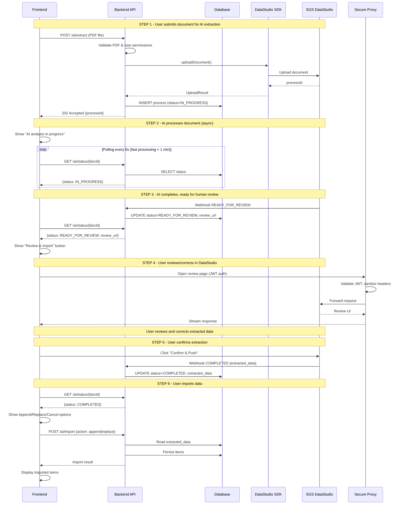

# SGS AI DataStudio SDK - Maven Integration Example

This project demonstrates how to integrate the **SGS AI DataStudio Java S

## Table of Contents

- [Prerequisites](#prerequisites)
- [Quick Start](#quick-start)
- [Local Development Guide](#local-development-guide)
- [Project Structure](#project-structure)
- [Configuration](#configuration)
- [Usage Examples](#usage-examples)
- [API Reference](#api-reference)
- [Integration Flow](#integration-flow)
- [Error Handling](#error-handling)
- [Best Practices](#best-practices)
- [Troubleshooting](#troubleshooting)
- [Keeping Dependencies Updated](#keeping-dependencies-updated) ⚠️

## Prerequisites

- **Java 21** or higher
- **Maven 3.8+**
- **DataStudio API Key** - Contact SGS to obtain your API credentials
- **Repository Access** - Credentials for the SGS Maven repository

## Quick Start

### 1. Configure Maven Repository Access

The SDK is hosted on private Registry. 

Add your repository credentials to `~/.m2/settings.xml`:

```xml
<settings>
  <servers>
    <server>
      <id>artifact-registry</id>
      <username>_json_key_base64</username>
      <password>YOUR_BASE64_ENCODED_SERVICE_ACCOUNT_KEY</password>
    </server>
  </servers>
</settings>
```

### 2. Configure pom.xml

Your `pom.xml` must include the following configuration to access the SDK repository:

```xml
<project>
  <distributionManagement>
    <snapshotRepository>
      <id>artifact-registry</id>
      <url>https://us-maven.pkg.dev/sgs-ai-acc-gen-prod/sgs-ai-accelerator-maven</url>
    </snapshotRepository>
    <repository>
      <id>artifact-registry</id>
      <url>https://us-maven.pkg.dev/sgs-ai-acc-gen-prod/sgs-ai-accelerator-maven</url>
    </repository>
  </distributionManagement>

  <repositories>
    <repository>
      <id>artifact-registry</id>
      <url>https://us-maven.pkg.dev/sgs-ai-acc-gen-prod/sgs-ai-accelerator-maven</url>
      <releases>
        <enabled>true</enabled>
      </releases>
      <snapshots>
        <enabled>true</enabled>
      </snapshots>
    </repository>
  </repositories>
</project>
```

### 3. Set Environment Variables

```bash
# Required
export DATASTUDIO_API_KEY=your_api_key_here
export DATASTUDIO_WEBHOOK_URL=https://your-ngrok-url.ngrok-free.app/webhooks

# Optional
export DATASTUDIO_ENVIRONMENT=SAND_BOX  # or PROD
export DATASTUDIO_USER=your_username
export DATASTUDIO_WEBHOOK_PORT=8080     # default: 8080
```

### 4. Build the Project

```bash
mvn clean package
```

### 5. Run the Application

```bash
# Run with a document
mvn exec:java -Dexec.args="/path/to/document.pdf"

# Or run the JAR directly
java -jar target/datastudio-sdk-example-1.0.0-SNAPSHOT.jar /path/to/document.pdf
```

## Local Development Guide

This section provides a step-by-step guide to run the demo locally with webhooks using ngrok.

### 1. Install ngrok

```bash
# macOS
brew install ngrok

# Or download from https://ngrok.com/download
```

### 2. Start ngrok

Open a terminal and start ngrok to expose a local port (e.g., 8080):

```bash
ngrok http 8080
```

ngrok will display a public URL like:
```
Forwarding  https://abc123.ngrok-free.app -> http://localhost:8080
```

Copy the `https://...ngrok-free.app` URL.

### 3. Configure Environment Variables

```bash
# Required
export DATASTUDIO_API_KEY=your_api_key_here

# Configure ngrok URL for webhooks
export DATASTUDIO_WEBHOOK_URL=https://abc123.ngrok-free.app/webhooks

# Optional
export DATASTUDIO_ENVIRONMENT=SAND_BOX
export DATASTUDIO_USER=local-dev-user
```

### 4. Build the Project

```bash
mvn clean package
```

### 5. Run with Example Documents

The project includes a sample document in `src/main/resources/examples/`:

```
examples/
└── export-declaration/
    └── example_custom_export.pdf
```

**Run with the example export declaration:**

```bash
mvn exec:java -Dexec.args="src/main/resources/examples/export-declaration/example_custom_export.pdf"
```

**Or using the JAR directly:**

```bash
java -jar target/datastudio-sdk-example-1.0.0-SNAPSHOT.jar \
  src/main/resources/examples/export-declaration/example_custom_export.pdf
```

### 6. Monitor Webhook Events

While the application runs, you can monitor incoming webhook events in the ngrok web interface:

- Open http://localhost:4040 in your browser
- You'll see all incoming HTTP requests to your webhook endpoint
- This is useful for debugging and verifying webhook payloads

## Project Structure

```
src/main/java/com/example/datastudio/
├── Application.java              # Main entry point with CLI interface
├── config/
│   └── DataStudioConfig.java     # Configuration management
├── service/
│   ├── DocumentProcessorService.java  # Single document processing
│   └── BatchDocumentProcessor.java    # Batch processing with concurrency
├── model/
│   └── ProcessedDocument.java    # Type-safe result model
└── webhook/
    └── WebhookHandler.java       # Webhook event handling
```

## Configuration

### Environment Variables

| Variable | Required | Default | Description |
|----------|----------|---------|-------------|
| `DATASTUDIO_API_KEY` | Yes | - | Your API key for authentication |
| `DATASTUDIO_WEBHOOK_URL` | Yes | - | Base URL for webhook endpoints (e.g., ngrok URL) |
| `DATASTUDIO_ENVIRONMENT` | No | `SAND_BOX` | Environment: `PROD` or `SAND_BOX` |
| `DATASTUDIO_USER` | No | `example-user` | Username for document tracking |
| `DATASTUDIO_WEBHOOK_PORT` | No | `8080` | Port for the embedded webhook server |

### Programmatic Configuration

```java
// From environment (recommended)
DataStudioConfig config = DataStudioConfig.fromEnvironment();

// For sandbox testing
DataStudioConfig config = DataStudioConfig.forSandbox("your-api-key", "https://your-webhook-url");

// For production
DataStudioConfig config = DataStudioConfig.forProduction("your-api-key", "username", "https://your-webhook-url");
```

## Usage Examples

### Basic Document Upload

```java
import ai.accelerator.DataStudioSDK;
import ai.accelerator.DataStudioSDK.*;

// Initialize SDK
DataStudioSDK sdk = DataStudioSDK.Builder.aDataStudioSDK()
    .withApiKey(System.getenv("DATASTUDIO_API_KEY"))
    .withEnvironment(Environments.PROD)
    .build();

// Upload document
Path filePath = Path.of("/path/to/invoice.pdf");
Map<String, String> metadata = Map.of(
    "customer_id", "CUST-123",
    "order_id", "ORD-456"
);

UploadResult result = sdk.uploadDocument(
    "john.doe",
    DocType.INVOICE,
    filePath,
    metadata
);

System.out.println("Process ID: " + result.processId());
System.out.println("Status: " + result.status());
```

### Using DocumentProcessorService

```java
import com.example.datastudio.service.DocumentProcessorService;
import org.json.JSONObject;

// Create processor service
DocumentProcessorService processor = new DocumentProcessorService(sdk);

// Upload and wait for result (with automatic polling)
JSONObject result = processor.uploadAndWaitForResult(
    "john.doe",
    DocType.EXPORT_DECLARATION,
    Path.of("/path/to/declaration.pdf"),
    Map.of("shipment_id", "SHIP-789")
);

// Access result data
System.out.println("Extracted Text: " + result.getString("extracted_text"));
System.out.println("Confidence: " + result.getDouble("confidence_score"));
```

### Asynchronous Processing

```java
// Process asynchronously with callbacks
processor.uploadAndProcessAsync(
    "john.doe",
    DocType.INVOICE,
    Path.of("/path/to/invoice.pdf"),
    null,
    result -> {
        // Success callback
        System.out.println("Processing complete!");
        System.out.println("URL: " + result.getString("url"));
    },
    error -> {
        // Error callback
        System.err.println("Processing failed: " + error.getMessage());
    }
);
```

### Batch Processing

```java
import com.example.datastudio.service.BatchDocumentProcessor;

BatchDocumentProcessor batchProcessor = new BatchDocumentProcessor(sdk, 5);

List<Path> documents = List.of(
    Path.of("invoice1.pdf"),
    Path.of("invoice2.pdf"),
    Path.of("invoice3.pdf")
);

BatchDocumentProcessor.BatchResult result = batchProcessor.processDocuments(
    "john.doe",
    DocType.INVOICE,
    documents,
    Map.of("batch_id", "BATCH-001"),
    progress -> {
        System.out.printf("Progress: %d/%d (%.1f%%)%n",
            progress.completedCount() + progress.failedCount(),
            progress.totalCount(),
            progress.completionPercentage());
    }
);

System.out.println("Success rate: " + result.successRate() + "%");
System.out.println("High confidence results: " +
    result.getHighConfidenceResults(0.9).size());
```

### Webhook Configuration

```java
// Initialize SDK with webhooks
DataStudioSDK sdk = DataStudioSDK.Builder.aDataStudioSDK()
    .withApiKey(apiKey)
    .withEnvironment(Environments.PROD)
    .withWebhooks(
        new WebHook(Events.READY_FOR_REVIEW, "https://your-app.com/webhooks/ready"),
        new WebHook(Events.COMPLETED, "https://your-app.com/webhooks/completed")
    )
    .build();
```

### Handling Webhooks (Spring Boot Example)

```java
import com.example.datastudio.webhook.WebhookHandler;

@RestController
@RequestMapping("/webhooks")
public class WebhookController {

    private final WebhookHandler handler;

    public WebhookController() {
        this.handler = new WebhookHandler()
            .onReadyForReview(payload -> {
                System.out.println("Document ready for review:");
                System.out.println(payload.toString(2));
                notificationService.notifyReviewers(payload);
            })
            .onCompleted(payload -> {
                System.out.println("Document completed:");
                System.out.println(payload.toString(2));
                documentService.markCompleted(payload);
            });
    }

    @PostMapping("/ready")
    public ResponseEntity<Void> handleReady(@RequestBody String payload) {
        handler.handleWebhook("document.ready_for_review", payload);
        return ResponseEntity.ok().build();
    }

    @PostMapping("/completed")
    public ResponseEntity<Void> handleCompleted(@RequestBody String payload) {
        handler.handleWebhook("document.completed", payload);
        return ResponseEntity.ok().build();
    }
}
```

### Using ProcessedDocument Model

```java
import com.example.datastudio.model.ProcessedDocument;

JSONObject result = sdk.getResult(processId);
ProcessedDocument doc = ProcessedDocument.fromJson(result);

// Type-safe access to result data
System.out.println("Pages: " + doc.pageCount().orElse(0));
System.out.println("Confidence: " + doc.confidenceScore().orElse(0.0));

// Check confidence threshold
if (doc.meetsConfidenceThreshold(0.85)) {
    System.out.println("High confidence result");
}

// Access structured data
doc.getStructuredFieldAsString("invoice_number")
   .ifPresent(num -> System.out.println("Invoice: " + num));
```

## API Reference

### Document Types

| DocType | API Value | Description |
|---------|-----------|-------------|
| `INVOICE` | `invoice` | Invoice documents |
| `EXPORT_DECLARATION` | `export_declaration` | Export declaration forms |

### Status Values

| Status | Description |
|--------|-------------|
| `UPLOADED` | Document queued and ready for processing |
| `IN_PROGRESS` | Document is being processed |
| `FAILED` | Processing failed |

### Webhook Events

| Event | Description |
|-------|-------------|
| `document.ready_for_review` | Document processed, ready for human review |
| `document.completed` | Document processing fully completed |

## Integration Flow

This diagram shows the complete flow for AI document extraction with human review.



### Flow Description

**STEP 1 - Upload Document**

User uploads a PDF through the frontend. The backend validates the file and user permissions, then uses the SDK to send the document to SGS DataStudio. DataStudio returns a `processId` which is stored in the database with status `IN_PROGRESS`. The frontend receives `202 Accepted` and displays a loading spinner.

**STEP 2 - AI Processing (async)**

While DataStudio AI processes the document (OCR, data extraction), the frontend polls `/ai/status/{docId}` every 5 seconds. The user sees "AI analysis in progress..." until processing completes (typically < 1 minute).

**STEP 3 - Ready for Human Review**

When AI processing finishes, DataStudio sends a `READY_FOR_REVIEW` webhook containing a `review_url`. The backend updates the database status. The next frontend poll detects the change and displays the **"Review & Import"** button.

**STEP 4 - Human Review in DataStudio**

User clicks "Review & Import" which opens the DataStudio review page (via Secure Proxy). The user can view all extracted data and **correct any AI errors** before confirming.

**STEP 5 - User Confirms Extraction**

Once satisfied with the data, the user clicks **"Confirm & Push"** in DataStudio. This triggers a `COMPLETED` webhook containing the `structured_data` JSON. The backend stores this data in the database.

**STEP 6 - Import Data**

The frontend detects `status=COMPLETED` and shows import options: **Append** | **Replace** | **Cancel**. The user chooses how to import the extracted items.

### Status Flow Summary

| Step | Action | DB Status |
|------|--------|-----------|
| 1 | Upload PDF | `IN_PROGRESS` |
| 2 | AI processes | `IN_PROGRESS` |
| 3 | AI completes | `READY_FOR_REVIEW` |
| 4 | User reviews/corrects | `READY_FOR_REVIEW` |
| 5 | User approves | `COMPLETED` |
| 6 | User imports | *(items persisted)* |

> **Key point**: Human review is mandatory before import. AI extracts the data, but the user validates it.

## Error Handling

The SDK provides specific exception types for different error scenarios:

```java
try {
    JSONObject result = processor.uploadAndWaitForResult(...);
} catch (FileValidationException e) {
    // File doesn't exist or exceeds 10 MB limit
    System.err.println("Invalid file: " + e.getMessage());

} catch (AuthenticationException e) {
    // Invalid API key (HTTP 401/403)
    System.err.println("Auth failed: " + e.getMessage());

} catch (DocumentNotFoundException e) {
    // Document/process ID not found (HTTP 404)
    System.err.println("Not found: " + e.getMessage());

} catch (NetworkException e) {
    // Network/IO errors
    System.err.println("Network error: " + e.getMessage());

} catch (ServerException e) {
    // Server errors (HTTP 5xx)
    System.err.println("Server error (" + e.getStatusCode() + "): " + e.getMessage());

} catch (DataStudioException e) {
    // Other SDK errors
    System.err.println("SDK error: " + e.getMessage());
}
```

## Best Practices

### 1. Secure API Key Storage

Never hardcode API keys. Use environment variables or a secrets manager:

```java
// Good
String apiKey = System.getenv("DATASTUDIO_API_KEY");

// Bad - Never do this
String apiKey = "sk-your-api-key-here";
```

### 2. Reuse SDK Instance

Create the SDK once and reuse it throughout your application:

```java
// Good - Create once, inject where needed
@Configuration
public class DataStudioConfig {
    @Bean
    public DataStudioSDK dataStudioSDK() {
        return DataStudioSDK.Builder.aDataStudioSDK()
            .withApiKey(apiKey)
            .withEnvironment(Environments.PROD)
            .build();
    }
}
```

### 3. Include Meaningful Metadata

Metadata helps with tracking and debugging:

```java
Map<String, String> metadata = Map.of(
    "customer_id", customerId,
    "order_id", orderId,
    "upload_source", "web-portal",
    "uploaded_by", currentUser
);
```

## Troubleshooting

### Dependency Resolution Failures

If Maven fails to resolve the SDK dependency with an error like:

```
Could not resolve dependencies... sgs-ai-datastudio-sdk-java:jar:0.1.0-alpha was not found
```

This may be a cached failure. Maven caches failed resolution attempts and won't retry until the cache expires. To fix:

1. **Clear the cached artifact:**
   ```bash
   rm -rf ~/.m2/repository/sgs/ai/accelerator/sgs-ai-datastudio-sdk-java
   ```

2. **Force Maven to re-check repositories:**
   ```bash
   mvn clean package -U
   ```

The `-U` flag forces Maven to check for updated releases and snapshots.

### Authentication Issues

If you see `401 Unauthorized` or `403 Forbidden` errors:

1. Verify your `~/.m2/settings.xml` contains the correct server configuration
2. Ensure the server `<id>` matches exactly: `artifact-registry`
3. Confirm your service account key is base64-encoded in the `<password>` field
4. Verify the service account has `Artifact Registry Reader` role on the `sgs-ai-acc-gen-prod` project

## Keeping Dependencies Updated

> ⚠️ **Why is this important?**
>
> The SGS AI DataStudio SDK is hosted in a **private Google Artifact Registry**, not in Maven Central. This means standard Dependabot configurations won't detect new SDK versions automatically.
>
> Properly configuring Dependabot ensures you receive:
> - **Security patches** — Critical fixes for vulnerabilities
> - **Bug fixes** — Stability improvements and corrections
> - **New features** — Access to the latest SDK capabilities
> - **Performance improvements** — Optimizations and enhancements
>
> Without this configuration, your project may run outdated SDK versions with known security issues or missing functionality.

### Setup Dependabot

Create `.github/dependabot.yml` in your repository:

```yaml
version: 2

registries:
  artifact-registry:
    type: maven-repository
    url: https://us-maven.pkg.dev/sgs-ai-acc-gen-prod/sgs-ai-accelerator-maven
    username: _json_key_base64
    password: ${{secrets.GCP_ARTIFACT_REGISTRY_KEY}}

updates:
  - package-ecosystem: "maven"
    directory: "/"
    schedule:
      interval: "weekly"
    registries:
      - artifact-registry
    open-pull-requests-limit: 5
    labels:
      - "dependencies"
```

> **IMPORTANT**: Since the SDK is hosted in a private Google Artifact Registry, you must configure a GitHub secret with your service account credentials for Dependabot to access it.

### Configure GitHub Secret

1. Go to your repository on GitHub
2. Navigate to **Settings** → **Secrets and variables** → **Dependabot**
3. Click **New repository secret**
4. Name: `GCP_ARTIFACT_REGISTRY_KEY`
5. Value: Your service account key encoded in base64

```bash
# Generate the base64-encoded key from your service account JSON file:
cat /path/to/your-service-account-key.json | base64 -w 0
```

Once configured, Dependabot will automatically create pull requests when new versions of the SDK or other dependencies are released.

## License

This example project is provided for demonstration purposes. The SGS AI DataStudio SDK is proprietary software - refer to your license agreement for usage terms.
