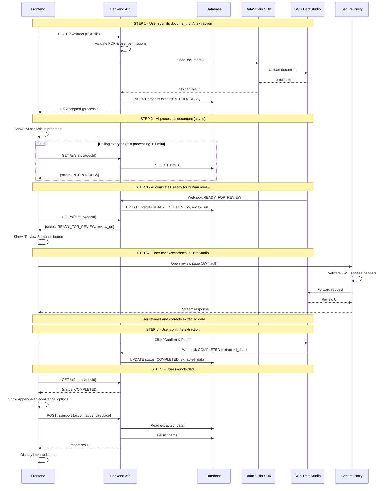

# SGS AI DataStudio SDK - Maven Integration Example

This project demonstrates how to integrate the **SGS AI DataStudio Java S

## Table of Contents

- [Prerequisites](#prerequisites)
- [Quick Start](#quick-start)
- [Local Development Guide](#local-development-guide)
- [Project Structure](#project-structure)
- [Configuration](#configuration)
- [Usage Examples](#usage-examples)
- [API Reference](#api-reference)
- [Webhook Signature Verification](#webhook-signature-verification)
- [Integration Flow](#integration-flow)
- [Error Handling](#error-handling)
- [Best Practices](#best-practices)
- [Troubleshooting](#troubleshooting)
- [Keeping Dependencies Updated](#keeping-dependencies-updated) ⚠️

## Prerequisites

- **Java 21** or higher
- **Maven 3.8+**
- **DataStudio API Key** - Contact SGS to obtain your API credentials
- **Repository Access** - Credentials for the SGS Maven repository

## Quick Start

### 1. Configure Maven Repository Access

The SDK is hosted on private Registry. 

Add your repository credentials to `~/.m2/settings.xml`:

```xml
<settings>
  <servers>
    <server>
      <id>artifact-registry</id>
      <username>_json_key_base64</username>
      <password>YOUR_BASE64_ENCODED_SERVICE_ACCOUNT_KEY</password>
    </server>
  </servers>
</settings>
```

### 2. Configure pom.xml

Your `pom.xml` must include the following configuration to access the SDK repository:

```xml
<project>
  <distributionManagement>
    <snapshotRepository>
      <id>artifact-registry</id>
      <url>https://us-maven.pkg.dev/sgs-ai-acc-gen-prod/sgs-ai-accelerator-maven</url>
    </snapshotRepository>
    <repository>
      <id>artifact-registry</id>
      <url>https://us-maven.pkg.dev/sgs-ai-acc-gen-prod/sgs-ai-accelerator-maven</url>
    </repository>
  </distributionManagement>

  <repositories>
    <repository>
      <id>artifact-registry</id>
      <url>https://us-maven.pkg.dev/sgs-ai-acc-gen-prod/sgs-ai-accelerator-maven</url>
      <releases>
        <enabled>true</enabled>
      </releases>
      <snapshots>
        <enabled>true</enabled>
      </snapshots>
    </repository>
  </repositories>
</project>
```

### 3. Set Environment Variables

```bash
# Required
export DATASTUDIO_API_KEY=your_api_key_here
export DATASTUDIO_WEBHOOK_URL=https://your-ngrok-url.ngrok-free.app/webhooks

# Optional
export DATASTUDIO_ENVIRONMENT=SAND_BOX             # or PROD
export DATASTUDIO_USER=your_username
export DATASTUDIO_WEBHOOK_PORT=8080                # default: 8080
export DATASTUDIO_WEBHOOK_SECRET=whsec_xxxxxxxx    # enables HMAC signature verification
```

### 4. Build the Project

```bash
mvn clean package
```

### 5. Run the Application

```bash
# Linux/macOS
mvn exec:java -Dexec.args="/path/to/document.pdf"

# Windows (PowerShell/CMD) - quotes must wrap the entire property
mvn exec:java "-Dexec.args=C:\path\to\document.pdf"

# Or run the JAR directly (all platforms)
java -jar target/datastudio-sdk-example-1.0.0-SNAPSHOT.jar /path/to/document.pdf
```

> **Note:** On Windows, the `-D` property must be quoted as a single argument (`"-Dexec.args=..."`). On Linux/macOS, both syntaxes work.

## Local Development Guide

This section provides a step-by-step guide to run the demo locally with webhooks using ngrok.

### 1. Install ngrok

```bash
# macOS
brew install ngrok

# Or download from https://ngrok.com/download
```

### 2. Start ngrok

Open a terminal and start ngrok to expose a local port (e.g., 8080):

```bash
ngrok http 8080
```

ngrok will display a public URL like:
```
Forwarding  https://abc123.ngrok-free.app -> http://localhost:8080
```

Copy the `https://...ngrok-free.app` URL.

### 3. Configure Environment Variables

```bash
# Required
export DATASTUDIO_API_KEY=your_api_key_here

# Configure ngrok URL for webhooks (must end in /webhooks — that is the path
# the embedded server listens on, see WebhookServer.java).
export DATASTUDIO_WEBHOOK_URL=https://abc123.ngrok-free.app/webhooks

# Optional — when set, every inbound webhook is HMAC-verified using the
# X-SGS-Signature / X-SGS-Timestamp headers. Get this value from the Portal
# (or POST /webhooks/secret/rotate). See "Webhook Signature Verification".
export DATASTUDIO_WEBHOOK_SECRET=whsec_xxxxxxxx

# Optional
export DATASTUDIO_ENVIRONMENT=SAND_BOX
export DATASTUDIO_USER=local-dev-user
```

### 4. Build the Project

```bash
mvn clean package
```

### 5. Run with Example Documents

The project includes a sample document in `src/main/resources/examples/`:

```
examples/
└── export-declaration/
    └── example_custom_export.pdf
```

**Run with the example export declaration:**

```bash
# Linux/macOS
mvn exec:java -Dexec.args="src/main/resources/examples/export-declaration/example_custom_export.pdf"

# Windows (PowerShell/CMD)
mvn exec:java "-Dexec.args=src\main\resources\examples\export-declaration\example_custom_export.pdf"
```

**Or using the JAR directly:**

```bash
java -jar target/datastudio-sdk-example-1.0.0-SNAPSHOT.jar \
  src/main/resources/examples/export-declaration/example_custom_export.pdf
```

### 6. Monitor Webhook Events

While the application runs, you can monitor incoming webhook events in the ngrok web interface:

- Open http://localhost:4040 in your browser
- You'll see all incoming HTTP requests to your webhook endpoint
- This is useful for debugging and verifying webhook payloads

## Project Structure

```
src/main/java/com/example/datastudio/
├── Application.java              # Main entry point with CLI interface
├── config/
│   └── DataStudioConfig.java     # Configuration management
├── service/
│   ├── DocumentProcessorService.java  # Single document processing
│   └── BatchDocumentProcessor.java    # Batch processing with concurrency
├── model/
│   └── ProcessedDocument.java    # Type-safe result model
└── webhook/
    └── WebhookHandler.java       # Webhook event handling
```

## Configuration

### Environment Variables

| Variable | Required | Default | Description |
|----------|----------|---------|-------------|
| `DATASTUDIO_API_KEY` | Yes | - | Your API key for authentication |
| `DATASTUDIO_WEBHOOK_URL` | Yes | - | Base URL for webhook endpoints (e.g., ngrok URL). Must end in `/webhooks` because the embedded server listens on `/webhooks/{ready,completed,failed}` |
| `DATASTUDIO_ENVIRONMENT` | No | `SAND_BOX` | Environment: `PROD` or `SAND_BOX` |
| `DATASTUDIO_USER` | No | `example-user` | Username for document tracking |
| `DATASTUDIO_WEBHOOK_PORT` | No | `8080` | Port for the embedded webhook server |
| `DATASTUDIO_WEBHOOK_SECRET` | No | - | HMAC signing secret (`whsec_…`). When set, the embedded server verifies every inbound webhook using the SDK's `WebhookVerifier` and rejects mismatched/stale deliveries with HTTP 401. See [Webhook Signature Verification](#webhook-signature-verification) |

### Programmatic Configuration

```java
// From environment (recommended)
DataStudioConfig config = DataStudioConfig.fromEnvironment();

// For sandbox testing
DataStudioConfig config = DataStudioConfig.forSandbox("your-api-key", "https://your-webhook-url");

// For production
DataStudioConfig config = DataStudioConfig.forProduction("your-api-key", "username", "https://your-webhook-url");
```

## Usage Examples

### Basic Document Upload

```java
import ai.accelerator.DataStudioSDK;
import ai.accelerator.DataStudioSDK.*;

// Initialize SDK
DataStudioSDK sdk = DataStudioSDK.Builder.aDataStudioSDK()
    .withApiKey(System.getenv("DATASTUDIO_API_KEY"))
    .withEnvironment(Environments.PROD)
    .build();

// Upload document
Path filePath = Path.of("/path/to/invoice.pdf");
Map<String, String> metadata = Map.of(
    "customer_id", "CUST-123",
    "order_id", "ORD-456"
);

UploadResult result = sdk.uploadDocument(
    "john.doe",
    DocType.INVOICE,
    filePath,
    metadata
);

System.out.println("Process ID: " + result.processId());
System.out.println("Status: " + result.status());
```

### Using DocumentProcessorService

```java
import com.example.datastudio.service.DocumentProcessorService;
import org.json.JSONObject;

// Create processor service
DocumentProcessorService processor = new DocumentProcessorService(sdk);

// Upload and wait for result (with automatic polling)
JSONObject result = processor.uploadAndWaitForResult(
    "john.doe",
    DocType.EXPORT_DECLARATION,
    Path.of("/path/to/declaration.pdf"),
    Map.of("shipment_id", "SHIP-789")
);

// Access result data
System.out.println("Extracted Text: " + result.getString("extracted_text"));
System.out.println("Confidence: " + result.getDouble("confidence_score"));
```

### Asynchronous Processing

```java
// Process asynchronously with callbacks
processor.uploadAndProcessAsync(
    "john.doe",
    DocType.INVOICE,
    Path.of("/path/to/invoice.pdf"),
    null,
    result -> {
        // Success callback
        System.out.println("Processing complete!");
        System.out.println("URL: " + result.getString("url"));
    },
    error -> {
        // Error callback
        System.err.println("Processing failed: " + error.getMessage());
    }
);
```

### Batch Processing

```java
import com.example.datastudio.service.BatchDocumentProcessor;

BatchDocumentProcessor batchProcessor = new BatchDocumentProcessor(sdk, 5);

List<Path> documents = List.of(
    Path.of("invoice1.pdf"),
    Path.of("invoice2.pdf"),
    Path.of("invoice3.pdf")
);

BatchDocumentProcessor.BatchResult result = batchProcessor.processDocuments(
    "john.doe",
    DocType.INVOICE,
    documents,
    Map.of("batch_id", "BATCH-001"),
    progress -> {
        System.out.printf("Progress: %d/%d (%.1f%%)%n",
            progress.completedCount() + progress.failedCount(),
            progress.totalCount(),
            progress.completionPercentage());
    }
);

System.out.println("Success rate: " + result.successRate() + "%");
System.out.println("High confidence results: " +
    result.getHighConfidenceResults(0.9).size());
```

### Webhook Configuration

```java
// Initialize SDK with webhooks
DataStudioSDK sdk = DataStudioSDK.Builder.aDataStudioSDK()
    .withApiKey(apiKey)
    .withEnvironment(Environments.PROD)
    .withWebhooks(
        new WebHook(Events.READY_FOR_REVIEW, "https://your-app.com/webhooks/ready"),
        new WebHook(Events.COMPLETED, "https://your-app.com/webhooks/completed"),
        // Added in 0.2.0-alpha. If not registered, failures route to the ready URL above.
        new WebHook(Events.PROCESSING_FAILED, "https://your-app.com/webhooks/failed")
    )
    .build();
```

### Handling Webhooks (Spring Boot Example)

```java
import com.example.datastudio.webhook.WebhookHandler;

@RestController
@RequestMapping("/webhooks")
public class WebhookController {

    private final WebhookHandler handler;

    public WebhookController() {
        this.handler = new WebhookHandler()
            .onReadyForReview(payload -> {
                System.out.println("Document ready for review:");
                System.out.println(payload.toString(2));
                notificationService.notifyReviewers(payload);
            })
            .onCompleted(payload -> {
                System.out.println("Document completed:");
                System.out.println(payload.toString(2));
                documentService.markCompleted(payload);
            });
    }

    @PostMapping("/ready")
    public ResponseEntity<Void> handleReady(@RequestBody String payload) {
        handler.handleWebhook("document.ready_for_review", payload);
        return ResponseEntity.ok().build();
    }

    @PostMapping("/completed")
    public ResponseEntity<Void> handleCompleted(@RequestBody String payload) {
        handler.handleWebhook("document.completed", payload);
        return ResponseEntity.ok().build();
    }
}
```

### Using ProcessedDocument Model

```java
import com.example.datastudio.model.ProcessedDocument;

JSONObject result = sdk.getResult(processId);
ProcessedDocument doc = ProcessedDocument.fromJson(result);

// Type-safe access to result data
System.out.println("Pages: " + doc.pageCount().orElse(0));
System.out.println("Confidence: " + doc.confidenceScore().orElse(0.0));

// Check confidence threshold
if (doc.meetsConfidenceThreshold(0.85)) {
    System.out.println("High confidence result");
}

// Access structured data
doc.getStructuredFieldAsString("invoice_number")
   .ifPresent(num -> System.out.println("Invoice: " + num));
```

## API Reference

### Document Types

| DocType | API Value | Description |
|---------|-----------|-------------|
| `INVOICE` | `invoice` | Invoice documents |
| `EXPORT_DECLARATION` | `export_declaration` | Export declaration forms |

### Status Values

| Status | Description |
|--------|-------------|
| `UPLOADED` | Document queued and ready for processing |
| `IN_PROGRESS` | Generic in-progress state |
| `OCR_PROCESSING` | OCR stage running *(0.2.0-alpha)* |
| `AI_PROCESSING` | LLM extraction stage running *(0.2.0-alpha)* |
| `READY_FOR_REVIEW` | Document is ready for human review |
| `COMPLETED` | Processing finished successfully |
| `REVIEW_EXPIRED` | Review window expired without action *(0.2.0-alpha)* |
| `FAILED` | Processing failed |

> Treat any unrecognized status value as still-in-progress for forward compatibility.

### Webhook Events

| Event | Description |
|-------|-------------|
| `document.ready_for_review` | Document processed, ready for human review |
| `document.completed` | Document processing fully completed |
| `document.processing_failed` | Processing failed *(0.2.0-alpha — falls back to ready-for-review URL if not registered)* |

## Webhook Signature Verification

Every webhook delivered by api-gw is **HMAC-SHA256 signed** when the tenant has a signing secret configured. Each delivery carries:

| Header | Value |
|---|---|
| `X-SGS-Timestamp` | Unix epoch seconds at signing time |
| `X-SGS-Signature` | `v1=<hex>` — `HMAC_SHA256(secret, "<timestamp>.<raw_body>")` |

Verifying the signature is **mandatory in production** — without it, anyone who learns your webhook URL can forge deliveries.

### How this example wires it up

`WebhookServer` (see `src/main/java/com/example/datastudio/webhook/WebhookServer.java`) accepts an optional `WebhookVerifier` from the SDK. When constructed with one, every inbound POST goes through:

1. Read raw request bytes (do **not** re-serialize JSON — whitespace and field order changes break the HMAC).
2. Read `X-SGS-Signature` and `X-SGS-Timestamp` headers; if either is missing, respond `401`.
3. Call `verifier.verify(rawBody, timestamp, signature)`. The SDK throws `WebhookVerificationException` on stale timestamp (default tolerance: 5 minutes), signature mismatch, or malformed timestamp; we catch it and respond `401`.
4. Only on success does the parsed payload reach the registered handler.

`Application` builds the verifier from `DATASTUDIO_WEBHOOK_SECRET` and passes it to the server:

```java
WebhookVerifier verifier = null;
if (config.webhookSecret() != null && !config.webhookSecret().isBlank()) {
    verifier = new WebhookVerifier(config.webhookSecret(), Duration.ofMinutes(5));
}
WebhookServer server = new WebhookServer(config.webhookPort(), webhookHandler, verifier);
```

If you do not set `DATASTUDIO_WEBHOOK_SECRET`, the server logs a `WARN` on startup and accepts unsigned deliveries — fine for early experiments, **never acceptable in production**.

### Setting it up end-to-end

1. **Register your webhooks first**, then **rotate the secret**. The order matters — see the note below. The SDK builder registers your URLs automatically when `.withWebhooks(...)` is configured (i.e. on every app start).
2. Mint a signing secret:

   ```bash
   curl -sS -X POST \
     "https://api.docannotator.datastudio-dev.sgsaccelerator.ai/v1/webhooks/secret/rotate" \
     -H "X-API-Key: $DATASTUDIO_API_KEY"
   ```

   The response contains a fresh `whsec_…` value — copy it now, it is not retrievable later.
3. Export it and (re)launch the app:

   ```bash
   export DATASTUDIO_WEBHOOK_SECRET=whsec_xxxxxxxxxxxxxxxxxxxxxxxxxxxxxxxxxxxxxxxxxxxxxx
   mvn exec:java -Dexec.args="src/main/resources/examples/export-declaration/example_custom_export.pdf"
   ```

4. Upload a document. On delivery you should see, in the embedded server logs:

   ```
   Received document.ready_for_review webhook (1045 bytes)
   Signature OK for document.ready_for_review (signedAt=2026-04-29T13:01:52Z)
   ```

### Order matters: register webhooks first, then rotate

The signing secret is per-tenant and is stored on the webhook configs themselves. As of api-gw fix #2206, `POST /webhooks` preserves the existing tenant's `Secret`, `SecretPrevious`, `SigningEnabled`, and `SecretRotatedAt` across re-registration — so the SDK calling `withWebhooks(...)` on every app start no longer wipes signing state.

However, **rotation only takes effect on configs that already exist**. If you rotate before registering any webhooks, the new secret has nothing to attach to and is effectively dropped. Do it in this order:

1. Run the app once so the SDK registers your webhook URLs.
2. Call `POST /webhooks/secret/rotate` to mint and persist a secret onto those configs.
3. Set `DATASTUDIO_WEBHOOK_SECRET` and relaunch.

### Manual signature verification (smoke test)

If you want to confirm the verifier without a real webhook, sign a payload yourself with your secret and feed it to the embedded server. The signing scheme is:

```
v1=hex( HMAC_SHA256( secret_utf8, "<unix_ts>.<raw_body_bytes>" ) )
```

Anything else — an extra newline, a different field order, missing `v1=` prefix — will fail with `signature mismatch`.

### Secret rotation

`POST /webhooks/secret/rotate` returns both the new `secret` and the prior one as `secret_previous` for a grace window. The current SDK accepts a single secret per `WebhookVerifier` instance — during a rollover, instantiate two verifiers (one per secret) and accept the delivery if either verifies. A future SDK release may bake this in directly.

## Timeouts and Retries (`SdkConfig`)

Since 0.2.0-alpha the SDK accepts an explicit `SdkConfig` that controls per-stage HTTP timeouts and the retry policy. This example builds it in `Application.buildSdkConfig()` — see that method's Javadoc for the full rationale of every value. Summary:

```java
ExponentialBackoffPolicy retryPolicy = new ExponentialBackoffPolicy.Builder()
    .maxAttempts(3)                       // initial + up to 2 retries
    .initialDelay(Duration.ofMillis(500)) // first retry after 500 ms
    .maxDelay(Duration.ofSeconds(5))      // cap exponential growth at 5 s
    .jitter(0.20)                         // ±20% to avoid thundering herd
    .build();

SdkConfig config = SdkConfig.builder()
    .connectTimeout(Duration.ofSeconds(10))   // TCP + TLS
    .uploadTimeout(Duration.ofSeconds(120))   // raised from 60 s default for slow links
    .queryTimeout(Duration.ofSeconds(30))     // getStatus / getResult / webhook calls
    .retryPolicy(retryPolicy)
    .build();
```

**Key points to keep in mind**:

- **Timeouts are per HTTP attempt, not per call.** With retries the worst-case wall time is roughly `maxAttempts * stageTimeout + sum(retryDelays)`. Plan caller deadlines accordingly.
- **Only transient failures retry.** Network/timeout errors and 5xx responses retry; 4xx (validation, auth, idempotency conflicts) surface immediately.
- **Retries are safe by default.** Every upload carries an `Idempotency-Key` (UUID v4) preserved across retries — the server deduplicates so you never upload twice.
- **Pitfall — `SdkConfig.builder()` vs `SdkConfig.defaults()`:** `defaults()` ships with the exponential policy above; `builder()` defaults to **`NoRetryPolicy`** if you do not call `.retryPolicy(...)`. Always set the policy explicitly when starting from `builder()`.
- **Opt out of retries entirely** with `new NoRetryPolicy()` — useful when you have stronger external idempotency guarantees and want errors to surface immediately.

## Integration Flow

This diagram shows the complete flow for AI document extraction with human review.


```mermaid
sequenceDiagram
    participant FE as Frontend
    participant BE as Backend API
    participant DB as Database
    participant SDK as DataStudio SDK
    participant DS as SGS DataStudio
    participant Proxy as Secure Proxy

    Note over FE,DS: STEP 1 - User submits document for AI extraction

    FE->>BE: POST /ai/extract (PDF file)
    BE->>BE: Validate PDF & user permissions
    BE->>SDK: uploadDocument()
    SDK->>DS: Upload document
    DS-->>SDK: processId
    SDK-->>BE: UploadResult
    BE->>DB: INSERT process (status=IN_PROGRESS)
    BE-->>FE: 202 Accepted {processId}

    Note over FE,DS: STEP 2 - AI processes document (async)

    FE->>FE: Show "AI analysis in progress"

    loop Polling every 5s (fast processing < 1 min)
        FE->>BE: GET /ai/status/{docId}
        BE->>DB: SELECT status
        BE-->>FE: {status: IN_PROGRESS}
    end

    Note over FE,DS: STEP 3 - AI completes, ready for human review

    DS->>BE: Webhook READY_FOR_REVIEW
    BE->>DB: UPDATE status=READY_FOR_REVIEW, review_url

    FE->>BE: GET /ai/status/{docId}
    BE-->>FE: {status: READY_FOR_REVIEW, review_url}
    FE->>FE: Show "Review & Import" button

    Note over FE,DS: STEP 4 - User reviews/corrects in DataStudio

    FE->>Proxy: Open review page (JWT auth)
    Proxy->>Proxy: Validate JWT, sanitize headers
    Proxy->>DS: Forward request
    DS-->>Proxy: Review UI
    Proxy-->>FE: Stream response

    Note over FE,DS: User reviews and corrects extracted data

    Note over FE,DS: STEP 5 - User confirms extraction

    FE->>DS: Click "Confirm & Push"
    DS->>BE: Webhook COMPLETED {extracted_data}
    BE->>DB: UPDATE status=COMPLETED, extracted_data

    Note over FE,DS: STEP 6 - User imports data

    FE->>BE: GET /ai/status/{docId}
    BE-->>FE: {status: COMPLETED}
    FE->>FE: Show Append/Replace/Cancel options

    FE->>BE: POST /ai/import {action: append|replace}
    BE->>DB: Read extracted_data
    BE->>DB: Persist items
    BE-->>FE: Import result

    FE->>FE: Display imported items
```

### Flow Description

**STEP 1 - Upload Document**

User uploads a PDF through the frontend. The backend validates the file and user permissions, then uses the SDK to send the document to SGS DataStudio. DataStudio returns a `processId` which is stored in the database with status `IN_PROGRESS`. The frontend receives `202 Accepted` and displays a loading spinner.

**STEP 2 - AI Processing (async)**

While DataStudio AI processes the document (OCR, data extraction), the frontend polls `/ai/status/{docId}` every 5 seconds. The user sees "AI analysis in progress..." until processing completes (typically < 1 minute).

**STEP 3 - Ready for Human Review**

When AI processing finishes, DataStudio sends a `READY_FOR_REVIEW` webhook containing a `review_url`. The backend updates the database status. The next frontend poll detects the change and displays the **"Review & Import"** button.

**STEP 4 - Human Review in DataStudio**

User clicks "Review & Import" which opens the DataStudio review page (via Secure Proxy). The user can view all extracted data and **correct any AI errors** before confirming.

**STEP 5 - User Confirms Extraction**

Once satisfied with the data, the user clicks **"Confirm & Push"** in DataStudio. This triggers a `COMPLETED` webhook containing the `structured_data` JSON. The backend stores this data in the database.

**STEP 6 - Import Data**

The frontend detects `status=COMPLETED` and shows import options: **Append** | **Replace** | **Cancel**. The user chooses how to import the extracted items.

### Status Flow Summary

| Step | Action | DB Status |
|------|--------|-----------|
| 1 | Upload PDF | `IN_PROGRESS` |
| 2 | AI processes | `IN_PROGRESS` |
| 3 | AI completes | `READY_FOR_REVIEW` |
| 4 | User reviews/corrects | `READY_FOR_REVIEW` |
| 5 | User approves | `COMPLETED` |
| 6 | User imports | *(items persisted)* |

> **Key point**: Human review is mandatory before import. AI extracts the data, but the user validates it.

## Error Handling

The SDK provides specific exception types for different error scenarios:

```java
try {
    JSONObject result = processor.uploadAndWaitForResult(...);
} catch (FileValidationException e) {
    // File doesn't exist or exceeds 10 MB limit
    System.err.println("Invalid file: " + e.getMessage());

} catch (AuthenticationException e) {
    // Invalid API key (HTTP 401/403)
    System.err.println("Auth failed: " + e.getMessage());

} catch (DocumentNotFoundException e) {
    // Document/process ID not found (HTTP 404)
    System.err.println("Not found: " + e.getMessage());

} catch (NetworkException e) {
    // Network/IO errors
    System.err.println("Network error: " + e.getMessage());

} catch (ServerException e) {
    // Server errors (HTTP 5xx)
    System.err.println("Server error (" + e.getStatusCode() + "): " + e.getMessage());

} catch (IdempotencyConflictException e) {
    // Added in 0.2.0-alpha — HTTP 409, another request with the same Idempotency-Key
    // is still in flight. Back off and retry once it settles.
    System.err.println("Idempotency conflict (request_id=" + e.getRequestId() + ")");

} catch (DataStudioException e) {
    // Other SDK errors. 0.2.0-alpha exposes:
    //   e.getRequestId() — server-side correlation ID (quote on support tickets)
    //   e.getErrorCode() — machine-readable code (e.g. "wait_timeout", "validation_failed")
    System.err.println("SDK error: " + e.getMessage()
        + " [code=" + e.getErrorCode() + ", request_id=" + e.getRequestId() + "]");
}
```

## Best Practices

### 1. Secure API Key Storage

Never hardcode API keys. Use environment variables or a secrets manager:

```java
// Good
String apiKey = System.getenv("DATASTUDIO_API_KEY");

// Bad - Never do this
String apiKey = "sk-your-api-key-here";
```

### 2. Reuse SDK Instance

Create the SDK once and reuse it throughout your application:

```java
// Good - Create once, inject where needed
@Configuration
public class DataStudioConfig {
    @Bean
    public DataStudioSDK dataStudioSDK() {
        return DataStudioSDK.Builder.aDataStudioSDK()
            .withApiKey(apiKey)
            .withEnvironment(Environments.PROD)
            .build();
    }
}
```

### 3. Include Meaningful Metadata

Metadata helps with tracking and debugging:

```java
Map<String, String> metadata = Map.of(
    "customer_id", customerId,
    "order_id", orderId,
    "upload_source", "web-portal",
    "uploaded_by", currentUser
);
```

## Troubleshooting

### Dependency Resolution Failures

If Maven fails to resolve the SDK dependency with an error like:

```
Could not resolve dependencies... sgs-ai-datastudio-sdk-java:jar:0.1.0-alpha was not found
```

This may be a cached failure. Maven caches failed resolution attempts and won't retry until the cache expires. To fix:

1. **Clear the cached artifact:**
   ```bash
   rm -rf ~/.m2/repository/sgs/ai/accelerator/sgs-ai-datastudio-sdk-java
   ```

2. **Force Maven to re-check repositories:**
   ```bash
   mvn clean package -U
   ```

The `-U` flag forces Maven to check for updated releases and snapshots.

### Webhook Not Arriving / 401 on Delivery

When `DATASTUDIO_WEBHOOK_SECRET` is set, the embedded server enforces signature verification. Common failure modes:

- **`Rejecting unsigned … delivery (missing X-SGS-Signature/X-SGS-Timestamp)`** — the backend is delivering unsigned. The tenant either has no signing secret yet, or the secret was wiped (e.g. by a `POST /webhooks` re-registration before api-gw fix #2206). Rotate the secret again *after* the URLs are registered, then update `DATASTUDIO_WEBHOOK_SECRET`.
- **`Signature verification FAILED … signature mismatch`** — the secret on your end does not match what api-gw is signing with. Likely you copied a previous rotation's secret. Rotate again and use the new value.
- **`Signature verification FAILED … timestamp outside tolerance window`** — the receiver clock is skewed by more than 5 minutes from the signer. Sync system time (NTP) or widen `Duration.ofMinutes(5)` in `Application.startWebhookServer(...)`.
- **No delivery at all (ngrok inspector at `localhost:4040` shows `0 requests`)** — the registered URL is not what you think. Check the `Registering webhooks against backend` log line on startup; it must print the exact ngrok public URL with `/webhooks/{ready,completed,failed}` paths. If ngrok was restarted, its subdomain changed and your previous registration is dead — relaunch the app to re-register.

### Authentication Issues

If you see `401 Unauthorized` or `403 Forbidden` errors:

1. Verify your `~/.m2/settings.xml` contains the correct server configuration
2. Ensure the server `<id>` matches exactly: `artifact-registry`
3. Confirm your service account key is base64-encoded in the `<password>` field
4. Verify the service account has `Artifact Registry Reader` role on the `sgs-ai-acc-gen-prod` project

## Keeping Dependencies Updated

> ⚠️ **Why is this important?**
>
> The SGS AI DataStudio SDK is hosted in a **private Google Artifact Registry**, not in Maven Central. This means standard Dependabot configurations won't detect new SDK versions automatically.
>
> Properly configuring Dependabot ensures you receive:
> - **Security patches** — Critical fixes for vulnerabilities
> - **Bug fixes** — Stability improvements and corrections
> - **New features** — Access to the latest SDK capabilities
> - **Performance improvements** — Optimizations and enhancements
>
> Without this configuration, your project may run outdated SDK versions with known security issues or missing functionality.

### Setup Dependabot

Create `.github/dependabot.yml` in your repository:

```yaml
version: 2

registries:
  artifact-registry:
    type: maven-repository
    url: https://us-maven.pkg.dev/sgs-ai-acc-gen-prod/sgs-ai-accelerator-maven
    username: _json_key_base64
    password: ${{secrets.GCP_ARTIFACT_REGISTRY_KEY}}

updates:
  - package-ecosystem: "maven"
    directory: "/"
    schedule:
      interval: "weekly"
    registries:
      - artifact-registry
    open-pull-requests-limit: 5
    labels:
      - "dependencies"
```

> **IMPORTANT**: Since the SDK is hosted in a private Google Artifact Registry, you must configure a GitHub secret with your service account credentials for Dependabot to access it.

### Configure GitHub Secret

1. Go to your repository on GitHub
2. Navigate to **Settings** → **Secrets and variables** → **Dependabot**
3. Click **New repository secret**
4. Name: `GCP_ARTIFACT_REGISTRY_KEY`
5. Value: Your service account key encoded in base64

```bash
# Generate the base64-encoded key from your service account JSON file:
cat /path/to/your-service-account-key.json | base64 -w 0
```

Once configured, Dependabot will automatically create pull requests when new versions of the SDK or other dependencies are released.

## License

This example project is provided for demonstration purposes. The SGS AI DataStudio SDK is proprietary software - refer to your license agreement for usage terms.
